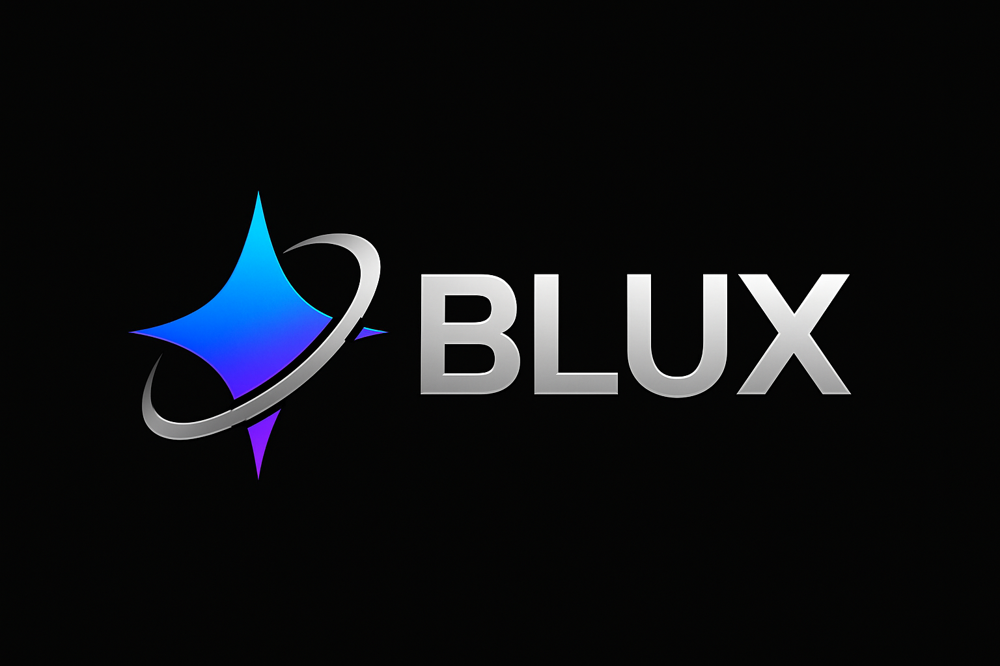

  

   

  <b>Space-Age Modular AI Ecosystem</b>

---

# BLUX

**The BLUX Project Umbrella**

---

**BLUX** is a modular, open-source ecosystem for next-generation AI-powered tools—local-first, privacy-respecting, and community-driven.  
This repository serves as the central hub and knowledge base for all BLUX projects, uniting advanced code agents, creative assistants, memory frameworks, and more.

---

## **Vision**

**BLUX** is dedicated to empowering individuals, developers, and communities to harness the power of modern AI without sacrificing privacy or independence.  
Our tools are designed to be plug-and-play, adaptable for any device, and free from paywalls or closed platforms.

---

## **Core Principles**

- **Local-First**: Use your own hardware—AI that lives and runs on your device.
- **Privacy & Security**: No user data leaves your device by default. Open-source by design.
- **Modular & Extensible**: Plug in new models, agents, and features as you wish.
- **Ethical by Default**: Strict policy against misuse, focused on creativity, education, and productivity.
- **Community-Guided**: Built for and with the community—contributors welcome at all levels.

---

## **BLUX Ecosystem Projects**

| Project        | Description                                               | Repo Link                                 |
|----------------|----------------------------------------------------------|--------------------------------------------|
| **BLUX-cA**    | Modular AI Coding Agent – the "hive mind" for coders     | [blux-ca](https://github.com/Justadudeinspace/blux-ca)         |
| **BLUX-Quantum**| Standalone CLI for AI-powered workflows (plug-in ready) | [blux-quantum](https://github.com/Justadudeinspace/blux-quantum) |
| **BLUX-Lite**  | Lightweight, privacy-first AI terminal (Termux/Ubuntu)   | [blux-lite](https://github.com/Justadudeinspace/blux-lite)     |
| *(More coming!)*| *(Your project here)*                                   |                                        |

---

## **Getting Started**

This repo contains all documentation, architecture diagrams, and high-level roadmaps for the **BLUX** family.  
**To get started with an individual tool, visit its repo above.**

---

## **How to Contribute**

We welcome all contributors—coders, designers, writers, and testers.  
Please read our [CONTRIBUTING.md](CONTRIBUTING.md) and [Code of Conduct](CODE_OF_CONDUCT.md).

---

## **Project Status**

**BLUX** is evolving rapidly—watch this repo for the latest news, updates, and release schedules for all subprojects!

---

## 📄 License

This project is licensed under the [**MIT License**](LICENSE).

> Permission is hereby granted, free of charge, to any person obtaining a copy  
> of this software and associated documentation files (the "Software"), to deal  
> in the Software without restriction, including without limitation the rights  
> to use, copy, modify, merge, publish, distribute, sublicense, and/or sell  
> copies of the Software, and to permit persons to whom the Software is  
> furnished to do so, subject to the following conditions:
>
> The above copyright notice and this permission notice shall be included in all  
> copies or substantial portions of the Software.
>
> THE SOFTWARE IS PROVIDED "AS IS", WITHOUT WARRANTY OF ANY KIND, EXPRESS OR  
> IMPLIED, INCLUDING BUT NOT LIMITED TO THE WARRANTIES OF MERCHANTABILITY,  
> FITNESS FOR A PARTICULAR PURPOSE AND NONINFRINGEMENT. IN NO EVENT SHALL THE  
> AUTHORS OR COPYRIGHT HOLDERS BE LIABLE FOR ANY CLAIM, DAMAGES OR OTHER  
> LIABILITY, WHETHER IN AN ACTION OF CONTRACT, TORT OR OTHERWISE, ARISING FROM,  
> OUT OF OR IN CONNECTION WITH THE SOFTWARE OR THE USE OR OTHER DEALINGS IN THE  
> SOFTWARE.
